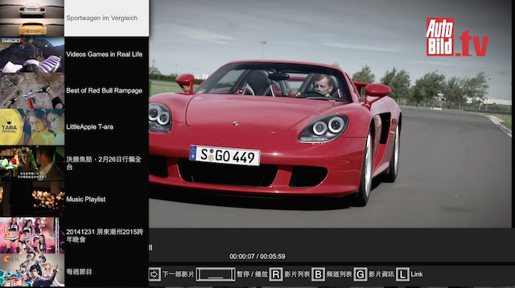

# youtube_tv
It's a youtube video player can play your playlist build on youtube

## Intro

Youtube can build playlist and add video to your playlist.
But when you want to watch it, you can feel bad user experience.
So this service can login with your google account and get your playlist and have friendly control experience.

### Support Browser

* IE 11+
* Chrome
* Safari
* Firefox

## Feature

* default playlist
* Login google account get playlist
* keyboard control

## ToDo list

* save last watch status
* full screen
* Android App
